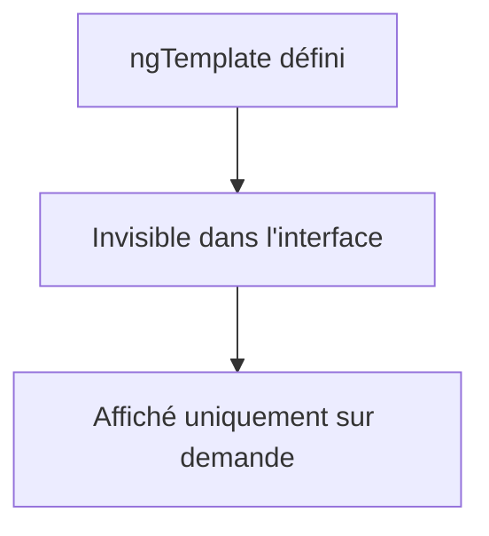
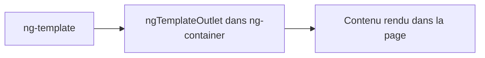
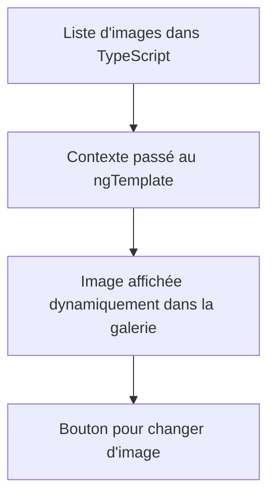

# ✨ Apprendre à Maîtriser `ngTemplate` dans Angular

Bienvenue dans ce cours immersif sur **`ngTemplate`**, un outil puissant d'Angular pour créer des interfaces dynamiques et réactives. ⚡️


---

## 🤸‍♂️ Qu'est-ce que `ngTemplate` ?

Un **`ngTemplate`** est une balise spéciale d'Angular permettant de définir un contenu HTML qui ne s'affiche que lorsqu'il est demandé. À l'état initial, ce contenu est caché, prêt à être utilisé de manière dynamique.

Voici une **représentation schématique** :



### ⚡ Syntaxe de base

```html
<ng-template>
  <p>Ceci est un contenu défini dans un template.</p>
</ng-template>
```

Par défaut, le contenu encapsulé dans `ng-template` **n'apparaît pas**.

---

## 🔄 Exemple : Affichage manuel avec `ng-container`

Prenons un scénario simple. Vous voulez afficher un contenu uniquement lorsque vous le décidez.

### HTML

```html
<ng-template #myTemplate>
  <p>Ceci est un message affiché depuis un ngTemplate ! 🎉</p>
</ng-template>

<!-- On affiche le contenu du template ici -->
<ng-container *ngTemplateOutlet="myTemplate"></ng-container>
```

### Explication

1. **`ng-template`** : Encapsule un contenu HTML (ici un paragraphe).
2. **`ngTemplateOutlet`** : Affiche dynamiquement le contenu du template à l'endroit spécifié.

Illustration :



---

## 🔗 Exemple parent-enfant : Une carte dynamique

Ajoutons une interaction parent-enfant pour utiliser des templates dynamiquement.

### Cas pratique : Une carte dynamique

#### Parent :

```html
<!-- Template pour l’en-tête -->
<ng-template #header>
  <h1>Bienvenue sur notre site 🌟</h1>
</ng-template>

<!-- Template pour le pied de page -->
<ng-template #footer>
  <footer>© 2024, Mon Application</footer>
</ng-template>

<!-- Appel des templates dans une carte -->
<app-card [headerTemplate]="header" [footerTemplate]="footer">
  <p>Voici le contenu principal de la carte. 🎨</p>
</app-card>
```

#### Enfant :

```html
<div class="card">
  <!-- Affichage du header -->
  <ng-container *ngTemplateOutlet="headerTemplate"></ng-container>

  <!-- Contenu principal -->
  <div class="content">
    <ng-content></ng-content>
  </div>

  <!-- Affichage du footer -->
  <ng-container *ngTemplateOutlet="footerTemplate"></ng-container>
</div>
```

#### TypeScript (enfant) :

```typescript
import { Component, Input, TemplateRef } from '@angular/core';

@Component({
  selector: 'app-card',
  templateUrl: './card.component.html',
  styleUrls: ['./card.component.css'],
})
export class CardComponent {
  @Input() headerTemplate!: TemplateRef<any>;
  @Input() footerTemplate!: TemplateRef<any>;
}
```

#### Rendu final attendu :

1. Un en-tête personnalisé.
2. Un contenu principal fourni par le parent.
3. Un pied de page.

---

## 🥇 Travaux Pratiques : Galerie Dynamique

### Objectif

Créer une galerie d’images où chaque image est rendue via un `ngTemplate`.

### 🔢 Instructions

1. **Créer une liste d'images** dans votre fichier TypeScript (3 à 5 images).
    
2. **Définir un** `**ng-template**` qui affiche une image à la fois.
    
3. Ajouter un bouton pour passer à l'image suivante en modifiant l'index de l'image actuelle.
    
4. **Ne copiez pas le code !** Faites-le étape par étape par vous-même pour bien comprendre chaque partie.
    

### Pistes pour le TypeScript :

1. Déclarez un tableau d'images :
    
    ```typescript
    images = ['image1.jpg', 'image2.jpg', 'image3.jpg'];
    ```
    
2. Créez une fonction `nextImage()` pour changer d'image :
    
    ```typescript
    nextImage() {
      this.currentIndex = (this.currentIndex + 1) % this.images.length;
    }
    ```
    

## Schéma de la Galerie

Voici une représentation graphique du fonctionnement :



---

Félicitations, vous avez maintenant une vue complète et pratique du `ngTemplate` dans Angular ! 🎉