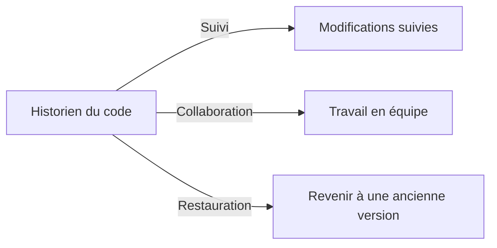
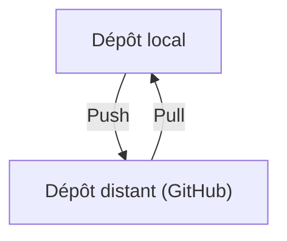
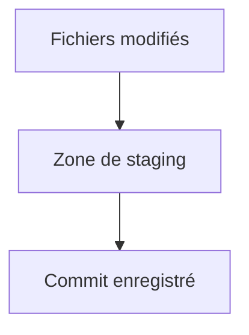
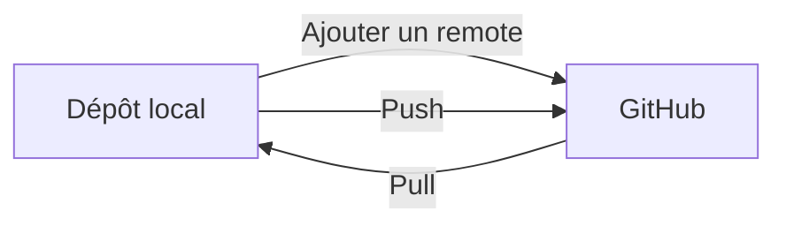
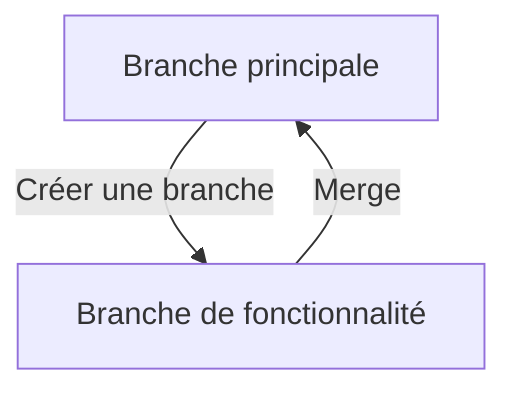

# 🎓 **Cours : Git et son intégration avec Visual Studio Code**

Dans ce cours, nous allons découvrir les bases de **Git** pour simplifier notre gestion de projets. 📘

---

## 📖 **Plan du cours**

1. Qu’est-ce que Git ?  
2. Installation et configuration de Git  
3. Les bases de Git : dépôt local et distant  
4. Intégration avec VS Code  
5. Travail Pratique (TP)  

---

## 🧠 **Partie 1 : Qu'est-ce que Git ?**

### 🚀 **Définition de Git**
Git est un logiciel de **gestion de versions**. Imaginez un historien qui garde une trace de chaque modification de votre projet, permet de collaborer avec d’autres personnes et vous offre une "machine à remonter le temps" en cas de problème.  




---

### 🎯 **Pourquoi utiliser Git ?**

| Fonctionnalité         | Pourquoi c’est utile ?                                                                 |
|-------------------------|---------------------------------------------------------------------------------------|
| Suivi des modifications | Historique complet de votre code.                                                     |
| Collaboration           | Travaillez avec d'autres développeurs sans écraser leurs modifications.              |
| Sauvegarde              | Sauvegardez votre code dans un dépôt distant pour éviter de le perdre.               |
| Gestion des branches    | Travaillez sur de nouvelles fonctionnalités sans risquer de casser le code principal. |


---

## ⚙️ **Partie 2 : Installation et configuration de Git**

### 🔧 **Installation de Git**
1. Rendez-vous sur [git-scm.com](https://git-scm.com/) et téléchargez Git.  
2. Installez-le en suivant les options par défaut.  

### 🖋️ **Configuration initiale**
Ouvrez un terminal et configurez Git avec vos informations :  
```bash
git config --global user.name "Votre Nom"
git config --global user.email "votre.email@example.com"
```

---

## 🛠️ **Partie 3 : Les bases de Git**

### 🌟 **Les concepts clés**

| Terme                | Définition                                                                                   |
|----------------------|-----------------------------------------------------------------------------------------------|
| **Dépôt local**      | Un espace sur votre ordinateur où Git suit les modifications de votre projet.                |
| **Dépôt distant**    | Une copie de votre projet stockée sur un serveur (comme GitHub), accessible depuis internet.  |
| **Remote**           | Le lien entre votre dépôt local et un dépôt distant.                                         |



---

### 🛠️ **Créer un dépôt local**
1. Créez un dossier pour votre projet (par exemple `MonProjet`).  
2. Initialisez un dépôt avec :  
   ```bash
   git init
   ```
3. Ajoutez un fichier, par exemple `README.md`, puis dites à Git de le suivre :  
   ```bash
   git add README.md
   ```

---

### 💾 **Faire un commit**
Un **commit** est comme une sauvegarde de votre projet :  
```bash
git commit -m "Message clair sur les changements apportés"
```




---

### 🌐 **Connecter un dépôt local à un dépôt distant**
1. Créez un dépôt sur [Git Lab](https://github.com/).  
2. Reliez votre dépôt local avec l'URL de GitHub :  
   ```bash
   git remote add origin https://github.com/votre-utilisateur/votre-repo.git
   ```
3. Envoyez votre projet vers GitHub :  
   ```bash
   git push -u origin main
   ```




---

### 🔄 **Collaborer avec un dépôt distant**
- **Pousser des changements** :  
   ```bash
   git push
   ```
- **Récupérer des changements** :  
   ```bash
   git pull
   ```

---

## 🌟 **Partie 4 : Intégration avec Visual Studio Code**

### 🤔 **Pourquoi VS Code ?**
VS Code intègre Git pour :  
- Voir les changements directement dans l’éditeur.  
- Gérer vos commits, branches et conflits visuellement.  


---

### 🔧 **Configurer Git dans VS Code**
1. Ouvrez un dossier contenant un dépôt Git.  
2. Cliquez sur l’onglet **Source Control** (icône de branche dans la barre de gauche).  
3. Ajoutez, committez et poussez vos fichiers directement depuis l’interface.
---

### 🛠️ **Travailler avec des branches **
1. Créez une branche :  
   ```bash
   git branch ma-branche
git checkout ma-branche
   ```
2. Faites des modifications, puis **mergez** dans la branche principale :  
   ```bash
git checkout main
git merge ma-branche
   ```



---

### 🛡️ **Résolution de conflits dans VS Code**
Quand deux développeurs modifient le même fichier, des conflits surviennent. VS Code propose un outil visuel pour :  
- Accepter une version.  
- Combiner les changements.  


---

## 🛠️ **Travail Pratique**

### Objectif : Créez un projet suivi par Git, synchronisez-le avec GitHub et gérez des branches dans VS Code.  

#### Étapes :  
1. Créez un dossier `ProjetTP` et initialisez un dépôt Git.  
2. Ajoutez un fichier `README.md` et faites un commit.  
3. Publiez ce dépôt sur GitHub.  
4. Créez une branche `feature/ajout-message`, modifiez `README.md` et mergez dans `main`.  
5. Simulez un conflit en modifiant le même fichier dans deux branches différentes, puis résolvez-le.  

---

Avec ce cours, vous avez maintenant les outils pour démarrer avec Git. 🚀  
Si vous avez des questions ou besoin d’exemples supplémentaires, je suis là pour vous aider ! 😊
